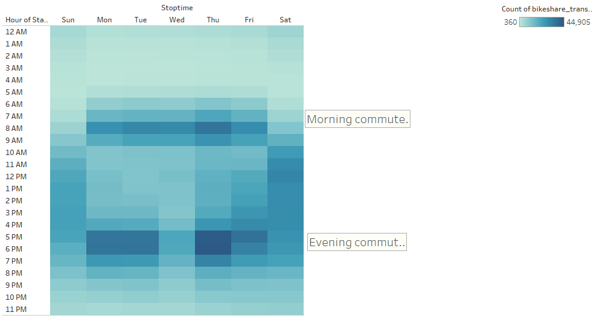

# Citi Bike Share Analysis

## Overview

This project analysis Citi bike data for the month of August in 2019. 

The analysis is tailored for an investor presentation to raise funds for creating a similar bike share operation in Des Moines, Iowa. 

This analysis will review subscription status, gender, rental times, rental duration, and customer age. This information will be used to target the ideal bike share customer.

The Tableau visualizations used in this analysis can be found [here](https://public.tableau.com/app/profile/david.garza8358/viz/Challenge_16511175389370/WhoUsesCitiBike).

## Results

### Demographics

The majority of the August ride shares were by yearly subrscribers and men. Yearly subscribers provide stable yearly income.

Older commuters trip averages about 15 minutes, while younger, possibly fun rides are about 20 minutes long. 

### Trip durations

Most if not all of the bike rentals are less than an hour. Most ride shares are less than 15 minutes. This might suggest commuters taking short back trips between home and work. Trips longer than 15 mintues may be tourist or fun rides.

The trend is similar between the genders.

### Rental times

Monday through Friday, the commuters dominate the ride share data. It is a very narrow band through out the work week at 8 am and a slightly larger band between 5 and 6 pm.

Lesuire and tourist riders seem to dominate from 11 am through 4 pm on Saturday.

#### Rental Times by Gender

The commuter and lesuire times are seen in both male and female riders. But the males still dominate the ride share market. On the heat map, the peak value for males is 30,000 while the peak value for females is 11,000.

### Rentals by Day of the Week

Again, we viewing all the data, males dominate the bike share market particularly Monday through Friday. 

Interesting note is that unknowns increase Saturday. Unkown, most likely represents non-subscription users most likely tourists or visitors using bikes to tour the city.

## Summary

The 2.3 million bike shares show that bike sharing business is successful in New York.

### Guaranteed Income

The data shows more than 75% of bike shares were yearly subscribers. A yearly subscription is confirmed cash flow into the business for at least a year. If the membership is automatic renewal, then business operations can be planned at least a year in advance.

### Primary Customer Base

The data shows that most of the customers are men using the bike share for commuting to and from work. I recommend promoting the bike share business through companies Human Resource departments to let their employees know about the bike share option of getting to and from work.

### Secondary Customer Base

A smaller group may be tourist / fun riders using the bike share for sight seeing or relaxation. I recommend placing the bike share stations in parks and high density tourist areas. Adversting should also be placed in hotel, motels, and travel centers to let visitors know about touring the city on bike.

### Additional Visualizations 

I recommend the following vizualizations:

1. Either plot or map the number of ride shares that start and end at the same location. This would indicate which areas are commuters and which are tourist stations. This can be used to stage bikes at specific stations before peak demands. For example, residential areas before the morning commute and near business centers before the evening commute. The data would need to be filtered by morning and evening commuting hours.

2. A visualization filtered by weekends and plotted as a map, should be able to show tourist / fun ride hotspots. This will help in the placement of bike stations for fun rides.

## Appendix

The data used for this analysis can be found [here](https://ride.citibikenyc.com/system-data).

Information about the Citi Bike ride share program can be found [here](https://account.citibikenyc.com/access-plans).